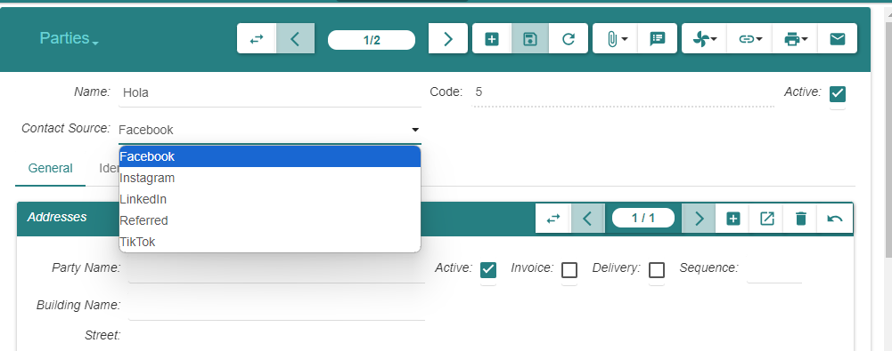
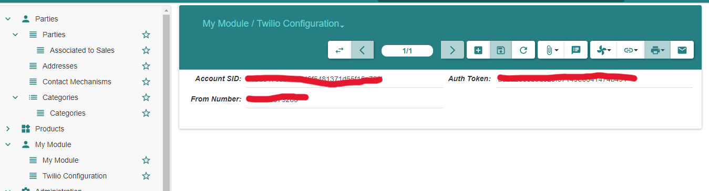
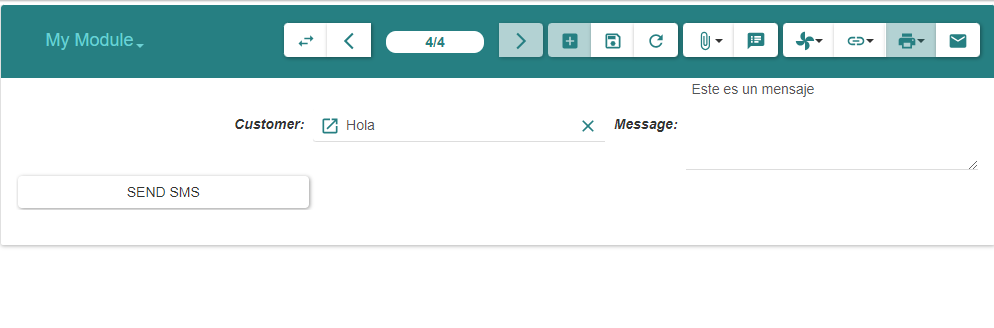

# Evaluación Técnica para Programador Tryton ERP Junior
## Sergio Mena Quispe

Este proyecto utiliza la versión 6.0 de Tryton. La imagen de Docker utilizada para la implementación es una imagen basada en Debian, la cual se puede encontrar en el siguiente enlace:  
[Imagen Docker de Tryton](https://foss.heptapod.net/tryton/tryton-docker)

## Tarea 1: Personalización del Módulo "Terceros"

### 1.1 Modificación del Modelo `Party`

Se añadió un campo de selección en el modelo `party.party` dentro del archivo `party.py` del módulo `party`. Este campo, llamado `contact_source`, permite seleccionar entre diversas fuentes de contacto:

```python
contact_source = fields.Selection([
    ('referred', 'Referred'),
    ('linkedin', 'LinkedIn'),
    ('instagram', 'Instagram'),
    ('facebook', 'Facebook'),
    ('tiktok', 'TikTok')
], 'Contact Source')
```

### 1.2 Actualización de la Vista

Para reflejar el nuevo campo en la interfaz, se añadió al formulario en el archivo `view/party_form.xml`:

```xml
<label name="contact_source" />
<field name="contact_source" />
```



### 1.3 Asignación de Permisos

Se añadieron permisos específicos para el campo `contact_source` en el archivo `party.xml`, asegurando que solo los administradores puedan modificar este campo:

```xml
<record model="ir.model.access" id="access_party_party">
    <field name="model">party.party</field>
    <field name="perm_read" eval="True"/>
    <field name="perm_write" eval="True"/>
</record>

<record model="ir.model.field.access" id="access_party_party_contact_source_admin">
    <field name="model">party.party</field>
    <field name="field">contact_source</field>
    <field name="group" ref="group_admin"/>
    <field name="perm_read" eval="True"/>
    <field name="perm_write" eval="True"/>
</record>
```

## Tarea 2: Creación de un Nuevo Módulo - "My Module"

### 2.1 Estructura del Módulo

El nuevo módulo creado, denominado "My Module", consta de dos modelos principales:

1. `my_module.twilio_configuration`: Para almacenar las credenciales de la API de Twilio.
2. `my_module.model`: Para gestionar el envío de SMS a los clientes.

Archivos del módulo:
- `__init__.py`: Inicializa los módulos Python dentro del paquete.
- `__tryton__.py`: Define la configuración del módulo en Tryton.
- `model.py`: Contiene la lógica principal para la gestión y envío de SMS.
- `my_module.xml`: Define las vistas y las acciones del módulo.
- `tryton.cfg`: Archivo de configuración que declara el módulo para Tryton.
- `twilio_configuration.py`: Define el modelo para la configuración de Twilio.

Archivos de vista:
- `my_module_form.xml`
- `my_module_list.xml`
- `twilio_configuration_form.xml`
- `twilio_configuration_list.xml`

### 2.2 Modelo de Configuración de Twilio

Se crearon tres campos en el modelo `TwilioConfiguration` para almacenar el Account SID, el Auth Token y el número de envío proporcionados por Twilio:

```python
class TwilioConfiguration(ModelSQL, ModelView):
    'Twilio Configuration'
    __name__ = 'my_module.twilio_configuration'

    account_sid = fields.Char('Account SID', required=True)
    auth_token = fields.Char('Auth Token', required=True)
    from_number = fields.Char('From Number', required=True)
```



### 2.3 Modelo para Envío de SMS

Se crearon dos campos en el modelo `my_module.model`: uno para seleccionar al cliente y otro para ingresar el mensaje a enviar. El cliente se selecciona de las `parties` ya creadas, permitiendo así asignar un nombre y número de teléfono:

```python
customer = fields.Many2One('party.party', 'Customer', required=True)
message = fields.Text('Message', required=True)
```



### 2.4 Obtención del Número de Teléfono

El número de teléfono del cliente se obtiene del modelo `party.contact_mechanism`:

```python
ContactMechanism = Pool().get('party.contact_mechanism')
phone_contact = ContactMechanism.search([
    ('party', '=', record.customer.id),
    ('type', '=', 'phone')
], limit=1)

to_number = phone_contact[0].value
```

### 2.5 Configuración de Twilio y Envío del SMS

Se obtiene la configuración de Twilio y se realiza el envío del mensaje mediante la API:

```python
config = Pool().get('my_module.twilio_configuration').search([], limit=1)[0]

ACCOUNT_SID = config.account_sid
AUTH_TOKEN = config.auth_token
from_number = config.from_number

url = 'https://api.twilio.com/2010-04-01/Accounts/{}/Messages.json'.format(ACCOUNT_SID)

payload = {
    'From': from_number,
    'To': to_number,
    'Body': message_body
}

response = requests.post(url, data=payload, auth=HTTPBasicAuth(ACCOUNT_SID, AUTH_TOKEN))
```


## Lecciones Aprendidas

- **Modularidad de Tryton:** La arquitectura modular de Tryton facilita la creación y personalización de nuevos módulos, manteniendo un orden claro en la base de datos.
- **PYSON:** Comprender cómo funciona PYSON para la interacción con la base de datos ha sido fundamental.
- **Interacción entre código e interfaz:** La familiarización con Tryton a nivel de código ha mejorado mi comprensión de su interfaz gráfica.
